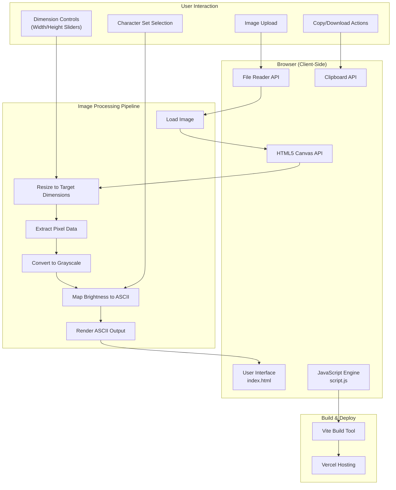
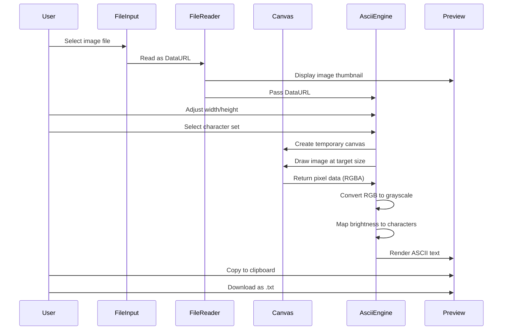

# Architecture Overview

## System Diagram

## Data Flow

## Key Architectural Decisions

### 1. 100% Client-Side Processing

I chose to implement all image processing entirely in the browser using the HTML5 Canvas API. This decision was driven by several factors:

- **Privacy**: User images never leave their device, which is important for potentially sensitive photos
- **Performance**: No network latency for conversions; results appear instantly
- **Cost**: No server infrastructure to maintain or pay for
- **Simplicity**: The entire application is static files that can be hosted anywhere

### 2. Vite as Build Tool

I selected Vite over alternatives like Webpack or Parcel because:

- **Speed**: Vite's native ES modules approach provides near-instant hot module replacement during development
- **Simplicity**: Minimal configuration required for a vanilla JavaScript project
- **Modern defaults**: Built-in support for ES modules, CSS imports, and asset handling

### 3. No Framework Dependency

I deliberately avoided React, Vue, or other frameworks because:

- **Project scope**: The application is simple enough that vanilla JavaScript handles all requirements
- **Bundle size**: The final build is extremely lightweight (~5KB of JavaScript)
- **Learning curve**: Anyone can read and modify the code without framework knowledge

### 4. Debounced Real-Time Updates

I implemented a 300ms debounce on slider inputs to balance responsiveness with performance:

- Users see immediate feedback when adjusting settings
- Prevents excessive re-renders during rapid slider movements
- Ensures smooth UX even with large output dimensions

### 5. Vercel Deployment with SPA Rewrites

I configured Vercel with URL rewrites to handle the single-page application pattern, ensuring direct links work correctly and the app behaves as expected when refreshed.

## Component Responsibilities

| Component | Responsibility |
|-----------|---------------|
| `index.html` | Structure, controls layout, character set definitions |
| `script.js` | Image loading, Canvas manipulation, ASCII conversion algorithm, clipboard/download handling |
| `style.css` | Visual design, responsive layout, animations |
| `vite.config.js` | Build configuration, asset handling |
| `vercel.json` | Deployment settings, URL rewrites |

## Limitations

- **Large images**: Very high-resolution source images may cause brief processing delays
- **Character density**: ASCII art resolution is inherently limited by character dimensions
- **Mobile typing**: Custom character input can be awkward on mobile keyboards
- **No persistence**: Settings and uploads are not saved between sessions
