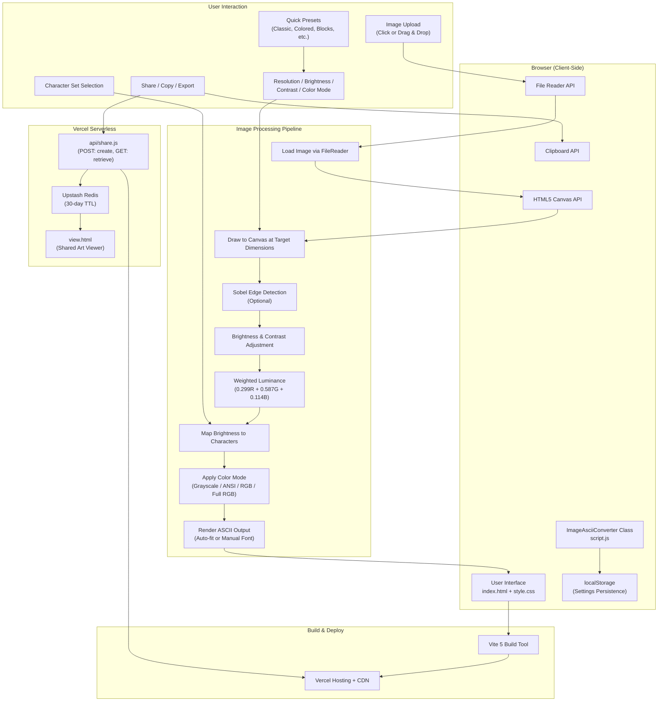
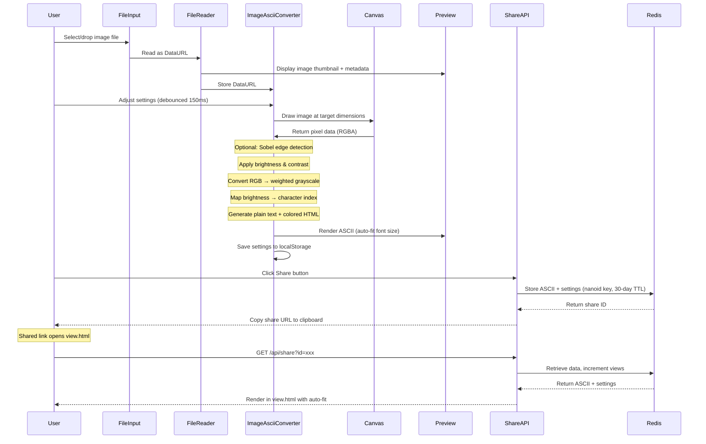

# Architecture Overview

## System Diagram

## Data Flow

## Component Descriptions

### ImageAsciiConverter Class (`src/script.js`)
- **Purpose**: Core application logic — image processing, ASCII conversion, UI setup, event handling, export functionality
- **Key responsibilities**: File upload handling, Canvas-based pixel extraction, Sobel edge detection, brightness/contrast adjustment, grayscale luminance calculation, character mapping, color mode rendering (Grayscale/ANSI/RGB/Full RGB), auto-fit font sizing, settings persistence via localStorage, share/copy/export operations
- **Pattern**: Single class with state management, debounced conversion, and DOM-based UI generation

### Share API (`api/share.js`)
- **Purpose**: Serverless endpoint for creating and retrieving shareable ASCII art links
- **Key responsibilities**: POST to create a share (generates nanoid, stores in Redis with 30-day TTL), GET to retrieve a share (increments view counter)
- **Dependencies**: `@upstash/redis`, `nanoid`

### View Page (`public/view.html`)
- **Purpose**: Standalone viewer for shared ASCII art with its own auto-fit logic and export buttons
- **Key responsibilities**: Fetches share data from API, renders ASCII with original color/font settings, provides copy/TXT/PNG/HTML download, displays view count and dimensions

### Main Entry (`index.html`)
- **Purpose**: HTML shell with critical inline CSS for loading state, loads `script.js` as ES module
- **Key responsibilities**: Provides `#app` mount point, shows loading spinner during module load

### Styles (`src/style.css`)
- **Purpose**: Full application layout and component styling
- **Key responsibilities**: Sidebar + main content flexbox layout, dark theme with CSS variables, responsive breakpoints at 900px and 480px, custom scrollbar and range input styling

## Key Architectural Decisions

### 1. Client-Side Image Processing
I chose to implement all image processing entirely in the browser using the HTML5 Canvas API.
- **Privacy**: User images never leave their device
- **Performance**: No network latency for conversions; results appear instantly
- **Cost**: No server infrastructure for the core conversion
- **Simplicity**: The conversion logic is self-contained in a single class

### 2. Hybrid Architecture for Sharing
The only server-side component is the share API. I used Vercel Serverless Functions with Upstash Redis to add sharing without complicating the core client-side architecture. Shares expire after 30 days to keep storage costs minimal.

### 3. Class-Based State Management
I encapsulated all application state in the `ImageAsciiConverter` class with localStorage persistence. This avoids framework dependencies while keeping state organized and recoverable across sessions.

### 4. No Framework Dependency
I deliberately avoided React, Vue, or other frameworks because:
- The application has a single view with manageable complexity
- The final JavaScript bundle stays extremely lightweight
- Anyone can read and modify the code without framework knowledge

### 5. Debounced Real-Time Updates
I implemented a 150ms debounce on all setting changes to balance responsiveness with performance. This prevents excessive re-renders during rapid slider movements while keeping the feel interactive.

### 6. Dual Color Output Pipeline
The converter generates both plain text and colored HTML in a single pass. This enables:
- Grayscale mode using `textContent` (fast, no DOM overhead)
- Color modes using `innerHTML` with per-character `` elements
- Export functions can choose the appropriate format without re-conversion

### 7. Auto-Fit Font Sizing
Rather than requiring users to manually set font sizes, the "Fit to Container" mode calculates the optimal font size based on the viewport dimensions and ASCII grid size. This ensures the output always fills the available space.

## Component Responsibilities

| Component | Responsibility |
|-----------|---------------|
| `index.html` | Entry point, critical CSS, loading state |
| `src/script.js` | ImageAsciiConverter class — all conversion and UI logic |
| `src/style.css` | Layout, theming, responsive design |
| `api/share.js` | Share creation/retrieval via Upstash Redis |
| `public/view.html` | Standalone shared art viewer with export |
| `vite.config.js` | Build configuration, asset handling |
| `vercel.json` | Deployment settings, API routing, CORS headers |

## Limitations

- **Large images**: Very high-resolution source images may cause brief processing delays during initial load
- **Color mode performance**: RGB/Full RGB modes generate a `` per character, which can be slow at high resolutions
- **Share size limits**: Very large ASCII outputs may approach Redis value size limits
- **No animation**: GIF files extract a single frame only
- **Mobile typing**: Custom character input can be awkward on mobile keyboards
